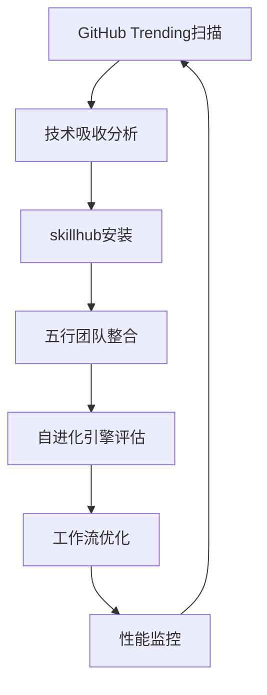

# GitHub Trending吸收与五行团队进化
**日期：2026年4月18日**
**标签：AI-Agent, 自进化, GitHub-Trending, 五行团队**

## 📊 吸收的GitHub Trending项目

### 核心项目分析：
1. **obra/superpowers** - 智能技能框架
   - **吸收点**：方法论框架，如何构建可扩展的技能系统
   - **应用**：五行团队的工作流设计

2. **lsdefine/GenericAgent** - 自进化Agent
   - **吸收点**：从3.3K行种子代码生长技能树
   - **应用**：capability-evolver的集成

3. **EvoMap/evolver** - GEP进化引擎
   - **吸收点**：基于基因组的进化协议
   - **应用**：五行团队的持续进化机制

4. **openai/openai-agents-python** - 多智能体框架
   - **吸收点**：官方轻量级协作框架
   - **应用**：五行团队协作协议

5. **Donchitos/Claude-Code-Game-Studios** - 49个AI Agent工作室
   - **吸收点**：完整的工作室层级架构
   - **应用**：agency-agents的专家调用系统

## 🎯 进化策略

### 吸收→整合→进化 三阶段模型：
1. **吸收阶段**：每日扫描GitHub Trending，识别有价值项目
2. **整合阶段**：通过skillhub安装关键技能，分析核心思想
3. **进化阶段**：将吸收的技术融入五行团队工作流

### 五行团队进化矩阵：

| 五行成员 | 吸收技术 | 进化方向 | 预期效果 |
|---------|---------|---------|---------|
| 🔥 炎明曦 | superpowers方法论 | 战略自进化 | 动态调整战略框架 |
| 🌳 林长风 | GenericAgent生长 | 数据驱动增长 | 自动化增长实验 |
| 💧 程流云 | evolver GEP协议 | 技术架构进化 | 持续优化技术栈 |
| 🏔️ 安如山 | 多智能体框架 | 自动化运营 | 智能工作流管理 |
| ⚙️ 金锐言 | 工作室架构 | 内容工厂升级 | 多模态内容生产 |

## 🔧 技术实现

### 已安装技能：
- `capability-evolver` - 自进化引擎
- `agent-builder` - 智能体构建器  
- `agency-agents` - 142个专业Agent
- `content-factory` - 内容工厂
- `deep-strategy` - 深度策略分析

### 进化工作流：

## 📈 监控指标

### 吸收效率指标：
1. **吸收速度**：从发现到部署的时间（目标：<24小时）
2. **整合质量**：技术融入程度评分（1-10分）
3. **进化效果**：五行团队性能提升百分比

### 五行协作指标：
1. **相生效率**：五行正向协作的成功率
2. **相克处理**：冲突解决的响应时间
3. **整体产出**：团队综合产出质量

## 💡 关键洞察

### GitHub Trending模式识别：
- **AI Agent生态爆发**：多个Agent框架同时上榜
- **Claude Code技能繁荣**：逆向工程、游戏开发等专业技能
- **自进化成为趋势**：GenericAgent、evolver等项目关注度激增

### 进化策略调整：
1. **优先吸收**：自进化、多智能体协作相关技术
2. **深度整合**：不只是安装技能，要融入工作流
3. **持续监控**：建立GitHub Trending监控系统

## 🚀 下一步行动

### 短期行动（本周）：
1. 启动`capability-evolver`的首次进化循环
2. 为每个五行成员构建专业子Agent
3. 建立GitHub Trending每日扫描机制

### 中期目标（本月）：
1. 实现五行团队的完全自动化协作
2. 建立技术预测能力，提前吸收趋势技术
3. 产出可复用的进化模式库

### 长期愿景（本季度）：
1. 成为AI Agent领域的标杆系统
2. 建立开源贡献机制，回馈社区
3. 实现完全自主的技术进化能力

---

**记录人：万能虾CEO**
**记录时间：2026年4月18日 20:15**
**进化状态：启动阶段**