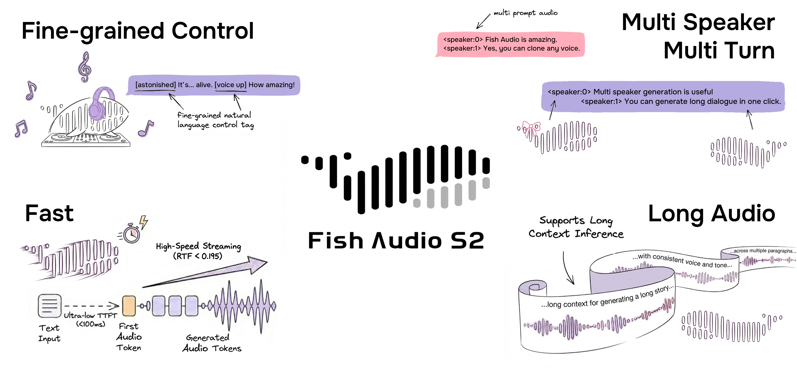

---
language:
- zh
- en
- ja
- ko
- es
- pt
- ar
- ru
- fr
- de
- sv
- it
- tr
- 'no'
- nl
- cy
- eu
- ca
- da
- gl
- ta
- hu
- fi
- pl
- et
- hi
- la
- ur
- th
- vi
- jw
- bn
- yo
- sl
- cs
- sw
- nn
- he
- ms
- uk
- id
- kk
- bg
- lv
- my
- tl
- sk
- ne
- fa
- af
- el
- bo
- hr
- ro
- sn
- mi
- yi
- am
- be
- km
- is
- az
- sd
- br
- sq
- ps
- mn
- ht
- ml
- sr
- sa
- te
- ka
- bs
- pa
- lt
- kn
- si
- hy
- mr
- as
- gu
- fo
license: other
license_name: fish-audio-research-license
license_link: LICENSE.md
pipeline_tag: text-to-speech
tags:
- text-to-speech
- instruction-following
- multilingual
inference: false
extra_gated_prompt: You agree to not use the model to generate contents that violate
  DMCA or local laws.
extra_gated_fields:
  Country: country
  Specific date: date_picker
  I agree to use this model for non-commercial use ONLY: checkbox
---

# Fish Audio S2 Pro



[**Technical Report**](https://huggingface.co/papers/2603.08823) | [**GitHub**](https://github.com/fishaudio/fish-speech) | [**Playground**](https://fish.audio)

**Fish Audio S2 Pro** is a leading text-to-speech (TTS) model with fine-grained inline control of prosody and emotion. Trained on over 10M+ hours of audio data across 80+ languages, the system combines reinforcement learning alignment with a dual-autoregressive architecture. The release includes model weights, fine-tuning code, and an SGLang-based streaming inference engine.

## Architecture

S2 Pro builds on a decoder-only transformer combined with an RVQ-based audio codec (10 codebooks, ~21 Hz frame rate) using a **Dual-Autoregressive (Dual-AR)** architecture:

- **Slow AR** (4B parameters): Operates along the time axis and predicts the primary semantic codebook.
- **Fast AR** (400M parameters): Generates the remaining 9 residual codebooks at each time step, reconstructing fine-grained acoustic detail.

This asymmetric design keeps inference efficient while preserving audio fidelity. Because the Dual-AR architecture is structurally isomorphic to standard autoregressive LLMs, it inherits all LLM-native serving optimizations from SGLang — including continuous batching, paged KV cache, CUDA graph replay, and RadixAttention-based prefix caching.

## Fine-Grained Inline Control

S2 Pro enables localized control over speech generation by embedding natural-language instructions directly within the text using `[tag]` syntax. Rather than relying on a fixed set of predefined tags, S2 Pro accepts **free-form textual descriptions** — such as `[whisper in small voice]`, `[professional broadcast tone]`, or `[pitch up]` — allowing open-ended expression control at the word level.

**Common tags (15,000+ unique tags supported):**

`[pause]` `[emphasis]` `[laughing]` `[inhale]` `[chuckle]` `[tsk]` `[singing]` `[excited]` `[laughing tone]` `[interrupting]` `[chuckling]` `[excited tone]` `[volume up]` `[echo]` `[angry]` `[low volume]` `[sigh]` `[low voice]` `[whisper]` `[screaming]` `[shouting]` `[loud]` `[surprised]` `[short pause]` `[exhale]` `[delight]` `[panting]` `[audience laughter]` `[with strong accent]` `[volume down]` `[clearing throat]` `[sad]` `[moaning]` `[shocked]`

## Supported Languages

S2 Pro supports 80+ languages.

**Tier 1:** Japanese (ja), English (en), Chinese (zh)

**Tier 2:** Korean (ko), Spanish (es), Portuguese (pt), Arabic (ar), Russian (ru), French (fr), German (de)

**Other supported languages:** sv, it, tr, no, nl, cy, eu, ca, da, gl, ta, hu, fi, pl, et, hi, la, ur, th, vi, jw, bn, yo, xsl, cs, sw, nn, he, ms, uk, id, kk, bg, lv, my, tl, sk, ne, fa, af, el, bo, hr, ro, sn, mi, yi, am, be, km, is, az, sd, br, sq, ps, mn, ht, ml, sr, sa, te, ka, bs, pa, lt, kn, si, hy, mr, as, gu, fo, and more.

## Production Streaming Performance

On a single NVIDIA H200 GPU:

- **Real-Time Factor (RTF):** 0.195
- **Time-to-first-audio:** ~100 ms
- **Throughput:** 3,000+ acoustic tokens/s while maintaining RTF below 0.5

## Links

- [Fish Speech GitHub](https://github.com/fishaudio/fish-speech)
- [Fish Audio Playground](https://fish.audio)
- [Blog & Tech Report](https://fish.audio/blog/fish-audio-open-sources-s2/)

## Technical Report

If you find our work useful, please consider citing our report:

```bibtex
@misc{liao2026fishaudios2technical,
      title={Fish Audio S2 Technical Report}, 
      author={Shijia Liao and Yuxuan Wang and Songting Liu and Yifan Cheng and Ruoyi Zhang and Tianyu Li and Shidong Li and Yisheng Zheng and Xingwei Liu and Qingzheng Wang and Zhizhuo Zhou and Jiahua Liu and Xin Chen and Dawei Han},
      year={2026},
      eprint={2603.08823},
      archivePrefix={arXiv},
      primaryClass={cs.SD},
      url={https://arxiv.org/abs/2603.08823},
}
```

## License

This model is licensed under the [Fish Audio Research License](LICENSE.md). Research and non-commercial use is permitted free of charge. Commercial use requires a separate license from Fish Audio — contact business@fish.audio.